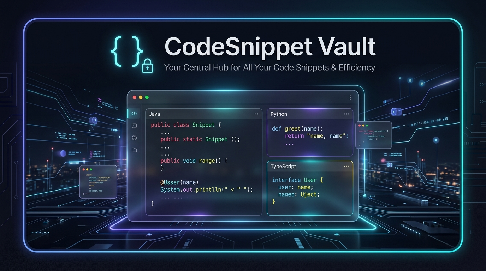
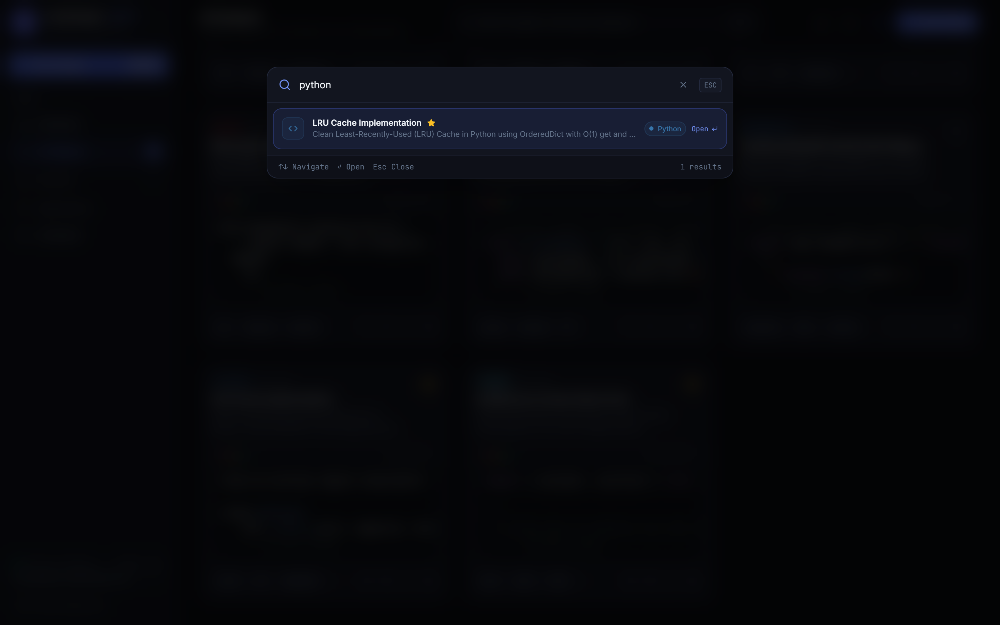
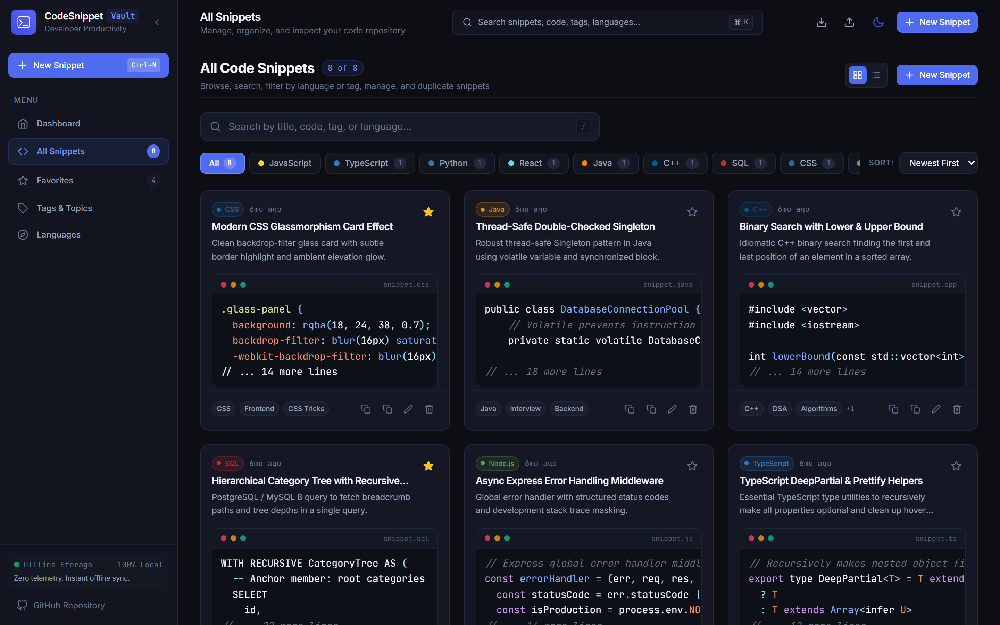
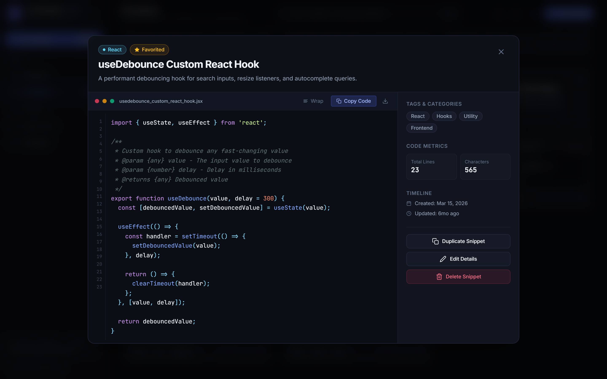
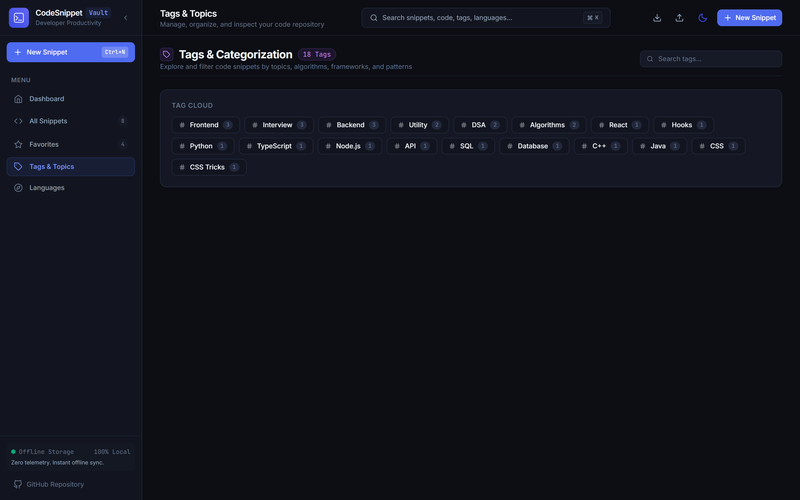
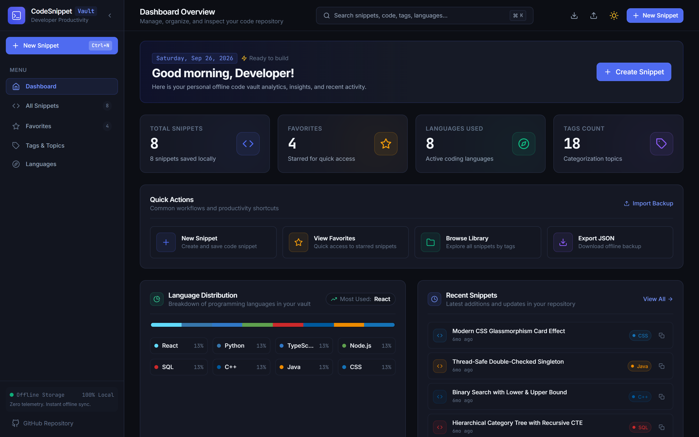

# CodeSnippet Vault

<div align="center">



```text
   ____          _        _____       _                    _     __      __             _ _   
  / ____|        | |      / ____|     (_)                  | |    \ \    / /            | | |  
 | |     ___   __| | ___ | (___  _ __  _ _ __  _ __   ___ _| |_    \ \  / /_ _ _   _   | | |_ 
 | |    / _ \ / _` |/ _ \ \___ \| '_ \| | '_ \| '_ \ / _ \_   _|    \ \/ / _` | | | | | | | __|
 | |___| (_) | (_| |  __/ ____) | | | | | |_) | |_) |  __/ | |_      \  / (_| | |_| |_| | |_ 
  \_____\___/ \__,_|\___||_____/|_| |_|_| .__/| .__/ \___|  \__|      \/ \__,_|\__,_(_)_|\__|
                                        | |   | |                                             
                                        |_|   |_|                                             
```

### Modern Minimalist Developer Code Snippet Manager
*A high-velocity blend of GitHub Gists, VS Code, Raycast, and Linear.*

[](https://react.dev/)
[](https://vitejs.dev/)
[](https://tailwindcss.com/)
[](https://www.framer.com/motion/)
[](https://prismjs.com/)
[]()
[](LICENSE)

[Visual Showcase](#-visual-showcase) • [Key Features](#-core-capabilities) • [Keyboard Shortcuts](#-keyboard-shortcuts) • [Architecture](#-architecture--folder-structure) • [Installation](#-getting-started)

</div>

---

## 🌟 Overview

**CodeSnippet Vault** is an offline-first developer productivity web application designed for software engineers, competitive programmers, and technical interview candidates. Designed with strict developer aesthetics, it marries the distraction-free minimalism of **Linear**, the command-driven velocity of **Raycast**, and the syntax fidelity of **VS Code**.

Every snippet is stored directly in your browser's Local Storage — meaning zero external dependencies, zero latency, and absolute privacy with 100% offline capability.

---

## 📸 Visual Showcase

### 📊 Developer Analytics Dashboard
Comprehensive overview with real-time statistics cards, interactive language distribution progress bar, recent code activity stream, and deep vault insights (lines of code, characters, average snippet length).

<div align="center">
  
</div>

<br/>

### ⚡ Raycast-Style Spotlight Search (`Ctrl + K` / `Ctrl + F`)
Instant full-text multi-token search modal across titles, descriptions, tags, languages, and actual source code with arrow-key keyboard navigation.

<div align="center">
  
</div>

<br/>

### 💻 Snippet Library & Multi-Stack Filtering
Browse snippets in grid or compact list view. Filter instantly by programming language (JavaScript, TypeScript, Python, React, SQL, C++, Java, Node.js) or search query.

<div align="center">
  
</div>

<br/>

### 🔍 Full Code Inspector & Metadata Viewer
Full-screen code inspector featuring syntax highlighting, line numbers gutter, soft tab support, word-wrap toggle, code metrics, and raw file download (`.jsx`, `.py`, `.sql`, `.cpp`).

<div align="center">
  
</div>

<br/>

### 🏷️ Topic Cloud & Tag Explorer
Categorize and filter snippets across data structures, algorithms, interviews, frontend utilities, and backend APIs.

<div align="center">
  
</div>

<br/>

### ☀️ Clean Slate Light Theme
High-contrast daylight theme with automated system preference detection and smooth theme morphing.

<div align="center">
  
</div>

---

## 🚀 Core Capabilities

<table>
<tr>
<td width="50%">

### 💻 Snippet Management
* **Instant Creation & Editing:** Form modal with live line counter, tab key indenting (2 spaces), and keyboard shortcuts (<kbd>Ctrl</kbd> + <kbd>Enter</kbd>).
* **One-Click Duplication:** Instantly clone snippets with preserved tags and language settings.
* **Safe Deletion:** Destructive modal confirmation prevents accidental data loss.
* **Native File Export:** Download raw code files directly with authentic extensions (`.jsx`, `.py`, `.sql`, etc.).

</td>
<td width="50%">

### 🔍 Real-Time Search & Spotlight
* **Multi-Token Fuzzy Search:** Real-time matching across titles, descriptions, code, tags, and languages.
* **Command Palette (<kbd>Ctrl</kbd> + <kbd>K</kbd>):** Fast spotlight search with keyboard navigation (<kbd>↑</kbd>, <kbd>↓</kbd>, <kbd>Enter</kbd>).
* **Instant Language Tabs:** Filter by active programming languages with dynamic count pills.

</td>
</tr>
<tr>
<td width="50%">

### 📊 Developer Analytics Dashboard
* **Metrics Grid:** Total Snippets, Pinned Favorites, Active Languages, and Tags.
* **Language Distribution Bar:** Multi-segment progress visualizer showing your vault's stack distribution.
* **Vault Insights:** Live aggregated counts for total lines of code stored, total characters, average snippet length, and dominant tags.

</td>
<td width="50%">

### 💾 100% Offline-First & Data Mobility
* **HTML5 Local Storage:** Fast local persistence with zero server latency and total privacy.
* **JSON Backup Export:** Download your entire repository as a portable `.json` backup file.
* **JSON Restore & Merge:** Import backup archives with automated schema validation and ID deduplication.

</td>
</tr>
</table>

---

## ⌨️ Keyboard Shortcuts

Speed up your developer workflow with first-class keyboard navigation:

| Shortcut | Action | Scope |
| :--- | :--- | :--- |
| <kbd>Ctrl</kbd> + <kbd>N</kbd> / <kbd>⌘</kbd> + <kbd>N</kbd> | Open New Snippet Creation Modal | Global |
| <kbd>Ctrl</kbd> + <kbd>K</kbd> / <kbd>⌘</kbd> + <kbd>K</kbd> | Open Command Palette / Spotlight Search | Global |
| <kbd>Ctrl</kbd> + <kbd>F</kbd> / <kbd>⌘</kbd> + <kbd>F</kbd> | Focus Search Engine Bar | Global |
| <kbd>Ctrl</kbd> + <kbd>Enter</kbd> / <kbd>⌘</kbd> + <kbd>Enter</kbd> | Submit and Save Snippet Form | Modal Editor |
| <kbd>Tab</kbd> | Insert 2-Space Soft Tab Indentation | Code Editor |
| <kbd>Esc</kbd> | Close Active Modal / Dismiss Search | Modals & Overlays |
| <kbd>↑</kbd> / <kbd>↓</kbd> | Navigate Search Result Items | Command Palette |
| <kbd>Enter</kbd> | Inspect Selected Snippet | Command Palette |

---

## 📁 Architecture & Folder Structure

Built using a scalable component architecture with modular design tokens:

```text
src/
├── assets/                  # Brand SVG emblems and media
├── components/
│   ├── common/              # Atomic design system
│   │   ├── Badge.jsx        # Language and tag pills
│   │   ├── Button.jsx       # Linear-style micro-animated buttons
│   │   ├── Card.jsx         # Glassmorphic container with glow borders
│   │   ├── CodeViewer.jsx   # Syntax-highlighted code block with line gutters
│   │   ├── CommandPaletteModal.jsx # Raycast-style spotlight search
│   │   ├── ConfirmModal.jsx # Destructive action confirmation dialog
│   │   ├── EmptyState.jsx   # Friendly empty illustrations & CTAs
│   │   ├── Input.jsx        # Monospace & sans-serif inputs with focus rings
│   │   ├── PageTransition.jsx # Framer Motion route transitions
│   │   ├── SearchBar.jsx    # Real-time search bar with clear button
│   │   ├── ThemeToggle.jsx  # Dark/Light theme morphing toggle
│   │   └── Toast.jsx        # Animated notification popups
│   ├── dashboard/           # Analytics & metric widgets
│   │   ├── FavoritesWidget.jsx     # Pinned favorite snippets
│   │   ├── LanguageDistribution.jsx# Stack percentage breakdown
│   │   ├── QuickActions.jsx        # One-click workflow triggers
│   │   ├── RecentSnippets.jsx      # Latest activity feed
│   │   ├── StatCard.jsx            # Individual stat metric card
│   │   ├── StatsGrid.jsx           # 4-column metric grid
│   │   └── VaultInsights.jsx       # Code volume and line counter analytics
│   ├── forms/               # Creation and editing modals
│   │   ├── SnippetForm.jsx         # Form with live line counting & tab indenting
│   │   └── SnippetFormModal.jsx    # Accessible modal wrapper
│   ├── layout/              # Responsive shell
│   │   ├── AppLayout.jsx           # Shell container with sticky navbar
│   │   ├── MobileBottomNav.jsx     # Mobile bottom drawer bar
│   │   ├── Navbar.jsx              # Command trigger, theme toggle, and actions
│   │   └── Sidebar.jsx             # Collapsible primary navigation
│   └── snippets/            # Snippet repository components
│       ├── FilterBar.jsx           # Language filter pills and sorters
│       ├── SnippetCard.jsx         # Grid & List view card with code preview
│       └── SnippetDetailModal.jsx  # Fullscreen code inspector & file exporter
├── constants/               # Supported languages, themes, and storage keys
├── context/                 # React Contexts (ToastContext, ThemeContext)
├── data/                    # Curated starter snippets (Hooks, Cache, CTE, DSA)
├── hooks/                   # Custom React hooks (useLocalStorage)
├── pages/                   # Views (Dashboard, Snippets, Favorites, Tags, Languages)
├── services/                # LocalStorage persistence, validation, JSON import/export
├── utils/                   # Clipboard, formatters, and search engine
├── App.jsx                  # Main orchestration component
├── index.css                # Tailwind base and VS Code dark theme rules
└── main.jsx                 # Application entry point
```

---

## 🛠️ Technology Stack

* **Frontend Framework:** React 18 / 19 + Vite
* **Styling & Design System:** Tailwind CSS (VS Code Dark Theme, Linear Minimalist Slate)
* **Animation & Micro-interactions:** Framer Motion
* **Iconography:** React Icons (Feather Icons & VS Code Icons)
* **Syntax Highlighting:** Prism.js (Custom VS Code dark syntax palette)
* **Storage Engine:** HTML5 Local Storage with JSON Backup / Restore
* **Code Splitting:** Manual chunking (`react-vendor`, `syntax-vendor`, `animation-vendor`, `icons-vendor`)
* **Package Manager:** NPM

---

## 🚀 Getting Started

### Prerequisites

Ensure you have [Node.js](https://nodejs.org/) installed (v18 or higher recommended).

### Installation

1. **Clone the repository:**
   ```bash
   git clone https://github.com/AlaminM01/CodeSnippet-Vault.git
   cd CodeSnippet-Vault
   ```

2. **Install dependencies:**
   ```bash
   npm install
   ```

3. **Start the development server:**
   ```bash
   npm run dev
   ```

4. **Build for production:**
   ```bash
   npm run build
   ```

5. **Preview production build locally:**
   ```bash
   npm run preview
   ```

---

## 🗺️ Future Roadmap

- [ ] **Gist Synchronization:** Two-way synchronization with GitHub Gists.
- [ ] **Folder Collections:** Multi-level folder nesting for large engineering teams.
- [ ] **Snippet Run Sandbox:** Integrated WebAssembly runtime to execute JavaScript/Python snippets in-browser.
- [ ] **OCR Code Scanner:** Paste an image or screenshot of code to automatically extract text into a snippet.

---

## 🤝 Contributing

Contributions make the developer community an amazing place to learn, inspire, and create. Any contributions you make are **greatly appreciated**.

1. Fork the Project
2. Create your Feature Branch (`git checkout -b feature/AmazingFeature`)
3. Commit your Changes (`git commit -m 'feat: add some amazing feature'`)
4. Push to the Branch (`git push origin feature/AmazingFeature`)
5. Open a Pull Request

---

## 📄 License

Distributed under the MIT License. See [`LICENSE`](LICENSE) for more information.

---

## 👨‍💻 Author

**Alamin Mondal**  
* GitHub: [@AlaminM01](https://github.com/AlaminM01)
* Repository: [CodeSnippet-Vault](https://github.com/AlaminM01/CodeSnippet-Vault)
* Email: [alaminmondal297@outlook.com](mailto:alaminmondal297@outlook.com)

---

<div align="center">
  <sub>Built with ❤️ for developers by developers. Inspired by Linear, Raycast, and VS Code.</sub>
</div>
